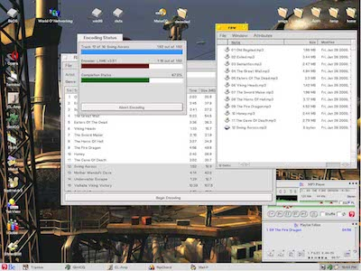

## The Rise and Fall of BeOS

[BeOS](https://en.wikipedia.org/wiki/BeOS), a partially POSIX compatible, UNIX-like operating system (and my second favorite OS of all time), was released by Be Incorporated in October of 1995 and was initially designed to run on AT&T's [Hobbit](https://en.wikipedia.org/wiki/AT%26T_Hobbit)-based hardware. It was later ported to the Apple's PowerPC platform and eventually ported again to the Intel platform in 1998.

BeOS was unique at the time in that it sported a 64-bit journaling file system known as Be File System ([BFS](https://en.wikipedia.org/wiki/Be_File_System)), ran on affordable hardware, and supported advanced operating system features like pervasive multi-threading, modular I/O bandwidth, symmetric multiprocessing, and preemptive multitasking. In fact, BeOS was so good that it was initially considered as the replacement for Apple's aging Classic Mac OS. Apple's board of directors eventually balked at the 300 million price tag and settled on Steve Jobs' [NeXTSTEP](https://en.wikipedia.org/wiki/NeXTSTEP). BeOS, having managed to build no more than a niche user base over the years, ceased to exist in 2001 when it was sold to Palm, Inc. for a paltry 11 million.

The last official version of BeOS was BeOS R5. However, BeOS R5.1 "Dano", which had been under active development, was leaked to the public shortly after the sale to Palm. BeOS fans, displeased with the sale, reacted by launching a complete, backward-compatible re-implementation of BeOS known as OpenBeOS. Years later OpenBeOS was renamed [Haiku](https://www.haiku-os.org). Haiku is still under development and is freely available to anyone wishing to relive the glory days of BeOS.

